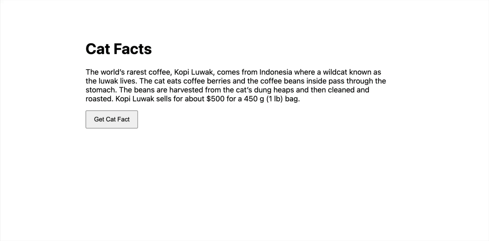

# Cat Facts — FastAPI + Vanilla JS

Small full-stack demo:
- **Backend:** FastAPI (`/ping`, `/catfact`), deployed on **Render**
- **Frontend:** HTML/CSS + vanilla JS, hosted on **GitHub Pages**

[URL](https://gsopas.github.io/catfacts-fastapi-vanilla/frontend/index.html)

[Live Demo](https://gsopas.github.io/catfacts-fastapi-vanilla/) • 

[ping_Render](https://catfacts-fastapi-vanilla-1.onrender.com/ping)

## Screenshot- gif

